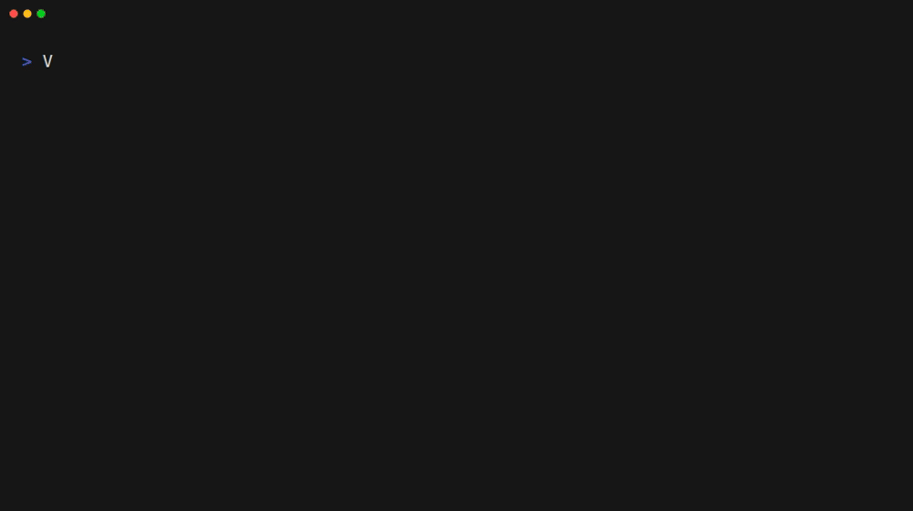

# Sarus Suite

Run HPC containers from one portable Linux bundle, built on top of [Podman](https://github.com/podman-container-tools/podman).

Download it, unpack it, and try containers in under a minute (without a
package manager or system-wide installation).

## Try it now

First, [prepare the Linux host](#runtime-requirements) and make sure the
rootless-container requirements are enabled.

Pick the archive for your host (`amd64` or `arm64`), then run the included
Ubuntu example:

```sh
VERSION=v26.8.3
ARCH=amd64 # use arm64 on ARM hosts

curl -LO "https://github.com/sarus-suite/sarus-suite/releases/download/${VERSION}/sarus-suite-${VERSION}-${ARCH}.tar.gz"
tar -xzf "sarus-suite-${VERSION}-${ARCH}.tar.gz"
cd sarus-suite
./bin/sarus-suite-shell -- sarusctl run examples/ubuntu.toml cat /etc/os-release
```

Test drive it:



## After your first run

Try the second example with the same command:

```sh
./bin/sarus-suite-shell -- sarusctl run examples/debian.toml cat /etc/os-release
```

Or open an interactive shell:

```sh
./bin/sarus-suite-shell
```

The bundle contains example EDF files at `examples/ubuntu.toml` and
`examples/debian.toml`. Check the local setup with:

```sh
./bin/sarus-suite-check
```

## System-wide installation for development

To make the bundled commands available to all users on a Linux host:

```sh
sudo ./bin/sarus-suite-system-install
```

This installs commands under `/usr/local/bin`, configuration under `/etc`,
and a per-user Parallax image store at `~/.sarus-suite/ro-store`. Start a new
login shell after installation, then use `podman`, `parallax`, `sarusctl`, or
`sarus-suite-check` directly.

Preview the installation without changing the host:

```sh
./bin/sarus-suite-system-install --dry-run
```

The installer refuses to replace differing files unless `--force` is supplied.
Use `--help` for deployment options such as `--prefix`, `--bin-dir`,
`--parallax-store`, `--install-root`, and `--report`.

## Testing local builds

A downloaded bundle can temporarily use locally built components:

```sh
./bin/sarus-suite-shell \
  --import-binary /path/to/sarusctl \
  --import-binary /path/to/parallax-static:parallax \
  --import-hook-dir /path/to/performance-extensions/target/release
```

Imported files replace the matching files in the extracted bundle. Use a copy
of the bundle when you need to preserve the original files.

## Building

Build a self-contained bundle with:

```sh
./scripts/build-bundle.sh
```

The build fetches upstream components, builds the helpers, assembles the
runtime tree under `dist/`, verifies it, and creates a compressed tarball.
The default Podman build is glibc-linked; use `PODMAN_MODE=static` for the
static fallback in a supported Alpine build environment.

The build requires `git`, `tar`, `curl` or `wget`, and either the
`devcontainer` CLI with a Docker/Podman backend or a supported Alpine build
environment. Build logs are written under `.work/logs/`; set `VERBOSE=1` to
stream full output. RPM packaging is available with:

```sh
./scripts/build-rpm.sh
```

## Runtime requirements

The bundle includes Podman, Sarus, Parallax, and the FUSE helpers. The target
Linux host only needs the rootless-container plumbing below, including the
FUSE 3 host support.

### Install on Ubuntu or Debian

Install these packages as root. `fuse3` is the required FUSE package:

```sh
sudo apt-get update
sudo apt-get install -y fuse3 uidmap
```

Other distributions provide the same components under packages usually named
`fuse3` and `uidmap`.

### Enable rootless containers

For each user who will run the bundle, `/etc/subuid` and `/etc/subgid` must
contain a subordinate ID range. For example, replace `alice` with the actual
username and add this range to both files:

```text
alice:100000:65536
```

The user must also be able to run the mapping helpers:

```sh
command -v newuidmap newgidmap
grep "^$(id -un):" /etc/subuid /etc/subgid
```

### Enable the kernel features

The host kernel must provide:

- unprivileged user namespaces, with `user.max_user_namespaces` greater than
  `0`;
- FUSE 3, installed through the distribution’s `fuse3` package, with
  `/dev/fuse` present and accessible to the user; and
- permission for the user to create rootless namespaces.

On systems that expose these settings, check them with:

```sh
sysctl user.max_user_namespaces
sysctl kernel.unprivileged_userns_clone 2>/dev/null || true
test -e /dev/fuse && echo "/dev/fuse: OK"
unshare -Ur true && echo "user namespaces: OK"
```

On Ubuntu, AppArmor can restrict unprivileged user namespaces even when the
sysctl values are correct. If `unshare -Ur true` is denied, review the active
AppArmor policy or ask the system administrator to allow unprivileged user
namespaces. Re-login after changing user/group or subordinate-ID settings.

Finally, validate the extracted bundle itself:

```sh
./bin/sarus-suite-shell -- sarus-suite-check
```

For bundle layout details, see [sarus-suite-bundle-artifacts.d2](docs/sarus-suite-bundle-artifacts.d2).
